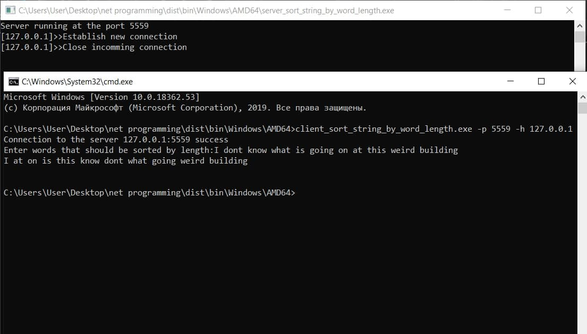

## Network programming based on socket API.

### Rybchenko Serhii | 4 variant

#### Самостійна робота №1
4. Сервер приймає від клієнта рядок символів, сортує його за довжиною
слів і повертає клієнту.

